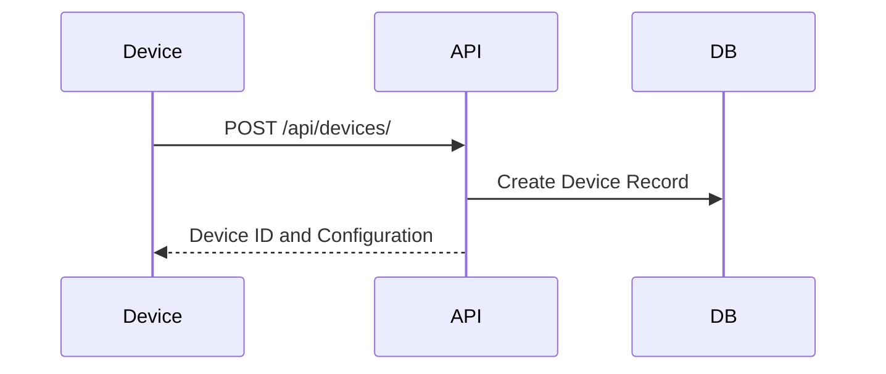
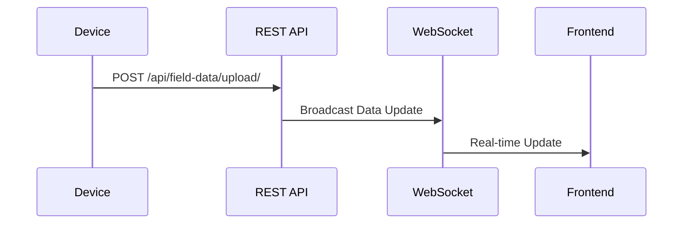

# Field Data Collection System Documentation

## Overview
The Field Data Collection System is a comprehensive solution for collecting, processing, and visualizing data from field devices deployed in various environmental monitoring scenarios. The system is built using modern web technologies and follows a microservices architecture for scalability and maintainability.

## System Architecture

### 1. Frontend Layer
- **Technologies Used**:
  - React.js for UI components
  - Leaflet.js for map visualization
  - WebSocket for real-time updates
  - Bootstrap/CSS for styling

- **Components**:
  - Map Interface
  - Device Management Dashboard
  - Data Visualization Panel
  - Alert Notification System

### 2. Backend Layer
- **Technologies Used**:
  - Django REST Framework
  - Django Channels for WebSocket
  - PostgreSQL for database
  - GeoDjango for spatial data

- **Key Components**:
  - REST API Endpoints
  - WebSocket Consumers
  - Data Processing Services
  - Alert System

### 3. Data Storage
- **Database Structure**:
  - `FieldDevice`: Device registration and configuration
  - `FieldDataRecord`: Raw sensor data
  - `FieldDataUpload`: Upload metadata
  - `ClimateData`: Processed climate data
  - `AlertLog`: Alert history

## Data Flow Architecture

### 1. Device Registration


### 2. Data Collection Process


## Technical Implementation

### 1. REST API Layer
- **Key Endpoints**:
  - `/api/devices/` - Device management
  - `/api/field-data/upload/` - Data upload
  - `/api/data/analysis/` - Data analysis
  - `/api/alerts/` - Alert management

- **Authentication**:
  - Token-based authentication
  - Session-based authentication
  - Rate limiting
  - CORS configuration

### 2. WebSocket Implementation
- **Consumer Classes**:
  - `FieldDataConsumer`: Handles real-time data updates
  - `AlertConsumer`: Manages alert notifications
  - `DeviceStatusConsumer`: Device status updates

- **Message Types**:
  ```json
  {
    "type": "data_update",
    "device_id": "string",
    "data": {
      "temperature": number,
      "humidity": number,
      "battery": number
    }
  }
  ```

### 3. Data Processing Pipeline
1. **Data Validation**
   - Format validation
   - Range checking
   - Data type verification

2. **Data Storage**
   - Raw data storage
   - Metadata processing
   - Spatial data handling

3. **Alert Generation**
   - Threshold-based alerts
   - Pattern recognition
   - Historical data analysis

## Security Features

### 1. Authentication & Authorization
- Device tokens
- User sessions
- Role-based access control
- API key management

### 2. Data Protection
- SSL/TLS encryption
- Data validation
- Input sanitization
- Rate limiting

### 3. Network Security
- WebSocket security
- API security headers
- CORS configuration
- Firewall rules

## Monitoring & Maintenance

### 1. System Monitoring
- Device status tracking
- Battery level monitoring
- Signal strength monitoring
- Error logging

### 2. Data Quality Assurance
- Data validation rules
- Outlier detection
- Data consistency checks
- Error recovery mechanisms

### 3. Performance Monitoring
- API response times
- Database performance
- WebSocket connection status
- System resource usage

## Deployment & Scaling

### 1. Infrastructure Requirements
- Web server (Nginx/Apache)
- Application server (Gunicorn/uWSGI)
- Database server (PostgreSQL)
- WebSocket server

### 2. Scaling Considerations
- Horizontal scaling of API servers
- Load balancing configuration
- Database replication
- WebSocket connection management

### 3. Backup & Recovery
- Database backups
- Configuration backups
- Disaster recovery procedures
- Data migration strategies

## Best Practices

### 1. Device Management
- Regular firmware updates
- Battery management
- Device calibration
- Maintenance scheduling

### 2. Data Handling
- Data validation
- Error handling
- Logging practices
- Data archiving

### 3. System Maintenance
- Regular updates
- Security patches
- Performance tuning
- Monitoring setup

## Troubleshooting Guide

### Common Issues
1. **Connection Problems**
   - WebSocket connection failures
   - API timeout errors
   - Network connectivity issues

2. **Data Issues**
   - Invalid data format
   - Missing required fields
   - Data consistency errors

3. **Performance Issues**
   - Slow response times
   - High memory usage
   - Database performance degradation

### Solutions
- Check system logs
- Verify network connectivity
- Validate data formats
- Monitor system resources
- Apply appropriate fixes

## Future Enhancements

### Planned Features
1. Advanced Analytics
   - Machine learning integration
   - Predictive maintenance
   - Pattern recognition

2. Enhanced Visualization
   - 3D map views
   - Advanced charts
   - Real-time dashboards

3. Mobile Support
   - Native mobile apps
   - Offline functionality
   - Push notifications

4. Integration Capabilities
   - Third-party service integration
   - API expansion
   - Custom plugin support

## Conclusion
The Field Data Collection System is a robust solution designed for efficient and reliable data collection from field devices. It combines modern web technologies with advanced data processing capabilities to provide a comprehensive monitoring solution. The system's modular architecture allows for easy maintenance and scalability while maintaining high performance and reliability.
